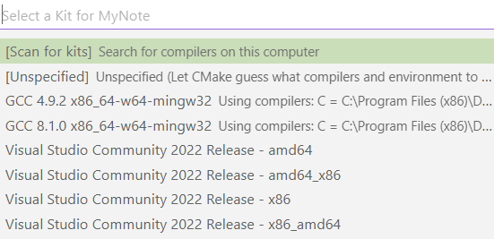

# 安装 & 配置 & 最简单的试编译

!!! abstract
    苯人使用的是 Windows + bash + VSCode

## 安装

* 需要安装 [CMake](https://cmake.org/download/)、[MinGW](https://sourceforge.net/projects/mingw/)
> 具体安装教程不再赘述

## 配置

* 将 CMake 和 MinGW 配置到系统路径
* 在 `bash` 中使用 `gcc --version` 和 `cmake --version` 检验是否配置到系统路径
    * 当出现版本信息的时候即配置成功
* VSCode 配置
    * 安装一些插件 —— `CMake` & `CMake Tools`
    * 在 VSCode 中 `ctrl+shift+p` 输入 `> CMake: 配置`， 会出现下列编译工具链选择框 (若未出现可能是为配置系统路径 or VSCode 重启试试) <br>

## 试编译

* 在文件夹中创建一个 `main.cpp` 和 `CMakeLists.txt`
    1. Internet 里有一种方法是和之前一样 `> CMake: 配置` 选择编译工具链，随后会自动当前目录下生成一个 `build` 文件夹，输入 `cmake ..` (若电脑安装了 VS)

    !!! note "踩坑"
        * 可能是我的有很多工作区的原因，在我的电脑中这种方法有时不成功。我便采用下一种方法。
        * 注意: 因为 windows 中 cmake 默认使用 nmake 程序 (所以输入 `cmake ..` 时会提示找不到 nmake), 因此需要指明 cmake 要生成 MinGW, make 使用的 makefile 文件: `cmake -G "MinGW Makefiles .."`
        * 如果此时出现问题 

        ```bash
        CMake Error: Error: generator : MinGW Makefiles
        Does not match the generator used **previously: NMake** Makefiles
        Either remove the CMakeCache.txt file and CMakeFiles directory or choose a different binary directory.

        ```

        * 原因: cmake 会在上一次执行文件的基础上直接执行，但上次使用的是 nmake 所以会出错。将 build 全部删除再执行就可以了

    2. 第二种办法，可以在 `bash` 中 
        ```bash
        $ mkdir build
        $ cd build
        $ cmake -G"MinGW Makefiles" ..
        ```
* 执行后，项目会生成在 build 文件夹中，使用 `make` 即可生成可执行文件，随后执行即可

    ??? note "踩坑 again"
        * 使用 MinGW 一般会显示没有 make, 原因是 `MinGW/bin` 中执行文件名不是 `make` 而是 `mingw32-make` (maybe)
        * 总之要么用 `mingw32-make` 代替 `make` 指令 or 拷贝一个 `mingw32-make` 并重命名为 `make`