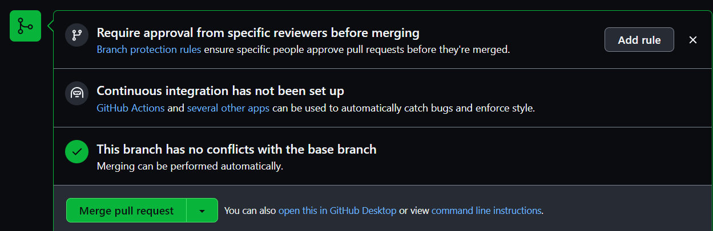

# Quickstart | 技术文档阅读

## Hello World

1. Creating a repository
2. Creating a branch
      1. 通过创建分支同时拥有 ==不同版本的存储库== 
      2. 默认分支 master , 从 master 创建的新分支是其副本或快照。若协作者对 master 分支进行了更新, 你可拉取这些更新
3. Making and committing changes
      1. 创建新分支后, GitHub 会将你转到其新分支代码页
      2. 在新分支下 commit 更改后, 这些更改仅适用于当前操作分支
4. Opening a pull request
      1. 在新分支 commit 后, 可打开 pull request (GitHub 上协作的核心)
      2. pull request 可显示两个分支内容的差异(只要进行提交, 便可 pull request 并开始讨论)
      3. 在 pull request 中使用 @mention 功能, 可向特定团队或人员请求 comment
5. Merging your pull request
      1. pull request 后, 将新分支的更改再合并到 master   
      2. 有时, pull request 可能会引入与 master 上现有代码冲突的代码更改。如果存在任何冲突, GitHub 将提醒您有关冲突代码的信息，并防止合并，直到冲突解决为止。您可以进行解决冲突的提交，也可以使用拉取请求中的注释与团队成员讨论冲突
      3. <u>接下来可安全删除新建分支, 若要对项目进行更多更改, 可随时创新新分支并重复此过程</u>(协作重要一环)

## Set up Git

!!! quote
     At the heart of GitHub is an open source version control system (VCS) called Git. Git is responsible for everything GitHub-related that happens locally on your computer.

### Using Git

* 配置
> [官方文档](https://docs.github.com/zh/get-started/quickstart/set-up-git#using-git) 

### Setting up Git

* 下载并安装最新版本的 Git
> [Git](https://git-scm.com/downloads)

#### 在 Git 中设置用户名

1. 关于 Git 用户名
      1. 使用 `git config` 命令更改与 Git 提交关联的名称 
      >  使用 `git config` 更改与 Git 提交关联的名称仅影响未来的提交，而不会更改用于过去提交的名称
2. 为计算机上的每个存储库设置 Git 用户名
      1. 打开 终端(Mac/Linux) || Git Bash(Windows)
      2. 设置 Git 用户名: 
      > $ git config --global user.name "MoLan"
      3. 确认正确设置了用户名: 
      > $ git config --global user.name 
      > MoLan
3. 为一个仓库设置 Git 用户名
      1. 打开 终端(Mac/Linux) || Git Bash(Windows)
      2. 将当前工作目录更改为要配置与 Git 提交关联的名称的本地仓库
      3. 设置 Git 用户名:  
      > $ git config user.name "MoLan"
      4. 确认:  
      > $ git config user.name 
      > MoLan

#### 在 Git 中设置提交电子邮件地址

* 关于提交电子邮件地址
    * 若想将个人电子邮件地址设为私密, 可使用 GitHub 的 `noreply` 电子邮件地址作为提交电子邮件地址要将 `noreply` 电子邮件地址用于从命令行推送的提交，请在 Git 中设置提交电子邮件地址时使用该电子邮件地址。 要将 `noreply` 地址用于基于 Web 的 Git 操作，请在 GitHub 上设置提交电子邮件地址并选择 "Keep my email address private"
!!! note
    2017 年 7 月 18 日后注册账户的, 来自 GitHub 的 `noreply` 电子邮件地址是 `USERNAME@user.noreply.github.com` 。可通过在电子邮件设置中选择(或重新选择) "Keep my email address private" , 为 GitHub 获取基于 ID 的 `noreply` 电子邮件地址 
* 在 GitHub 上设置提交电子邮件地址
    * 若尚未启用电子邮件隐私保护, 则在 GitHub 上编辑、删除或创建文件或者合并拉取请求时，可以选择将作者更改提交到哪个经验证的电子邮件地址。 如果启用了电子邮件地址隐私，则不能更改提交作者电子邮件地址，默认情况下是 `<username>@users.noreply.github.com`
    1. 在 GitHub Settings 添加电子邮件地址
    2. [验证电子邮件地址](https://docs.github.com/zh/get-started/signing-up-for-github/verifying-your-email-address)。
          1. 在 "Primary email address" 列表中选择要与基于 Web 的 Git 操作关联的电子邮件地址 
          2. 若要在执行基于 web 的 Git 操作时对电子邮件地址保密, 单击 "Keep my email addresses private" 
* 为计算机上的<u>每个仓库</u>设置电子邮件地址
    1. 打开 终端(Mac/Linux) || Git Bash(Windows)
    2. 在 Git 中设置电子邮件地址。可以使用 GitHub 提供的 noreply 电子邮件地址或其余电子邮件地址
      > $ git config --global user.email "YOUR_EMAIL"
    3. 确认在 Git 中正确设置了电子邮件地址: 
      > $ git config --global user.email
      > email@example.com
    4. 将电子邮件地址添加到 GitHub 上的账户，以便提交归属于你并显示在你的贡献图中
* 为<u>一个仓库</u>设置电子邮件地址
    1. 打开 终端(Mac/Linux) || Git Bash(Windows)
    2. 将当前工作目录更改为您想要在其中配置与 Git 提交关联的电子邮件地址的本地仓库
    3. 在 Git 中设置电子邮件地址。可以使用 GitHub 提供的 noreply 电子邮件地址或其余电子邮件地址
      > $ git config user.email "YOUR_EMAIL"
    3. 确认在 Git 中正确设置了电子邮件地址: 
      > $ git config user.email
      > email@example.com
    4. 将电子邮件地址添加到 GitHub 上的账户，以便提交归属于你并显示在你的贡献图中

### Authenticating with GitHub from Git

* 从 Git连接到 GitHub 存储库时，需要使用 HTTPS 或 SSH 向 GitHub 进行身份验证

#### 通过 HTTPS 连接

* 若使用 HTTPS 克隆，则可以使用凭据帮助程序在 Git 中缓存 GitHub 凭据

## Create a repo

## Fork a repo

## GitHub flow

## Contributing to projects

## Be social

## Communicating on GitHub

## GitHub glossary

## Git cheatsheet

## Learning resources

To Be Continued
