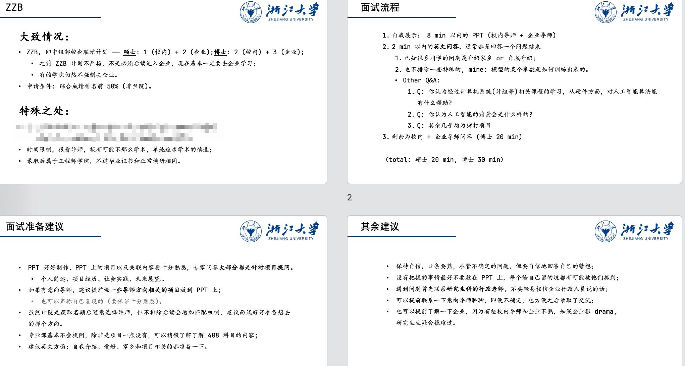

# 本科回忆录

仔细想来，我的 ZJU 好像从开始就充满了意外和幸运。

直到高考志愿填报前，我想过很多学校，但基本唯独没有考虑浙大，至于最终为什么选择了浙大也记不清了。

## 大一

大一上学期，迎来了专业分流，但因为我就是奔着网络安全来的浙大，分流也没什么纠结了，直接选择了信息安全。专业分流面试成为了我此生第一次强行外向，拉下脸面去积极回答问题。最后也是幸运地进入了我想去的专业。

!!! think "专业分流经验"
    - 具体问题现在参考价值不大了，因为多了笔试环节。
    - 最好的建议就是，提前可以学习 MOOC，在面试环节保持绝对的自信，不要怯场。

我的大一 GPA 一般般，这也怪我自己没有明确自己的未来规划，没有明确自己的目标，且由于自己的盲目自信，导致平时作业和 lab 虽然完成，但期末复习鲜少最终导致了平平的 GPA。

## 大二 —— 转折

大一暑假，我明确了自己的目标，准备好好学习。

!!! warning "Attention!!!"
    - 有些人可能对好好学习有误解，认为好好学习只是卷 GPA
    - 但对我来说，我总认为没必要为了卷 GPA 而好好学。专业本身就是我喜欢的，专业相关科目，为了掌握知识而学习，GPA 自然不会差；而通识等课程，其实能发现得分点就那几个，不感兴趣的课程，在能得分的地方下一点力气，拿到 89 还是很容易的。

按这套想法，大二上学期结束，还是收获了很可观的成绩，起码从我的案例看，不那么卷，也能拿到不错的成绩。

---

大二下学期开始后，本来继续维护之前的学习状态，顺风顺水。半个学期过去后，突发变故，因为身体原因，各个科目被迫缺课，还好在老师和 TA 的理解下，还算顺利结课了，不过也因为这个为期至今的变故，我基本放弃了保研的想法，转而准备考研。

## 大三

我的大三还算平淡，主要重点在于恢复身体，所修的课能结业足矣。

大三的意外应该算是我进入了 xht 老师的课题组，本来只是为了毕设和学习等作准备。但 xht 老师是个很好的老师，向我推荐了尝试 ZZB 保研。反正也是顺手，我就也准备了一点。

## 大四

保研过程算是大起大落，一波三折。具体经历还是不便透露了（怕被封杀

!!! info "ZZB 保研经验"
    

虽然保研过程很曲折，但目前看来我的大四感觉是最幸运的一年：身体恢复很多 + 知晓另一种也很愿意的保研方式 + 保研成功 + ...

!!! success
    我的未来刚刚开始，不求顺风顺水，只求努力有所回报。