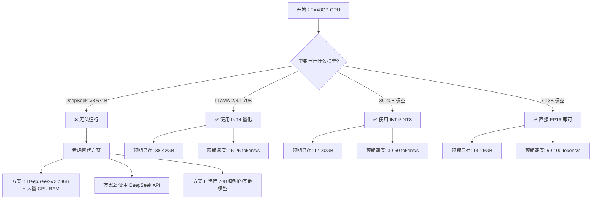
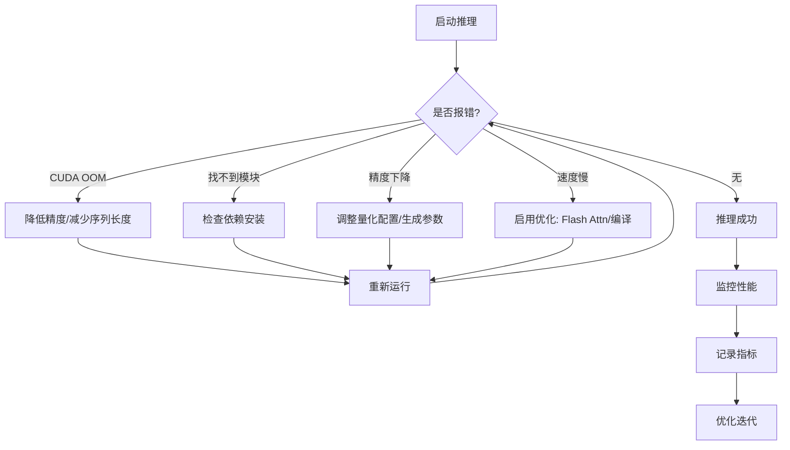

# LLM 量化技术与部署完全指南

!!! abstract "📚 文档概览"
    本文档提供了大语言模型（LLM）量化技术的系统性介绍，涵盖从理论基础到 Ubuntu 20.04 系统上的实际部署。适合研究人员、工程师以及对模型优化感兴趣的开发者。
---

## 量化技术理论基础

### 什么是模型量化？

!!! def "定义：模型量化（Model Quantization）"
    模型量化是一种模型压缩技术，通过降低神经网络中权重和激活值的数值精度（如从 32 位浮点数降至 8 位整数），在保持模型性能的同时，显著减少模型大小和计算开销。

### 为什么需要量化？

=== "显存占用问题"

    现代 LLM 参数量巨大，直接加载面临显存瓶颈。

<!-- 以下数据基于理论计算和实际测试[^1][^2][^3]：
| 模型 | 参数量 | FP16 显存[^4] | INT8 显存 | INT4 显存 |
|------|--------|--------------|-----------|-----------|
| LLaMA-2-7B | 7B | ~14-17GB | ~7-9GB | ~4-5GB |
| LLaMA-2-13B | 13B | ~26-32GB | ~13-16GB | ~7-8GB |
| LLaMA-2-70B | 70B | ~140-168GB | ~70-84GB | ~35-42GB |
| DeepSeek-V3 | 671B (37B 激活) | ~1342-1543GB | ~671-772GB | ~386-428GB |
[^1]: DeepSeek-V3 在 FP16 精度下需要约 1543GB VRAM
[^2]: 70B 参数模型在 FP16 精度下需要约 168GB VRAM（包含 20% 开销）
[^3]: LLaMA-2-70B FP16 模型总大小约 128.15GB
[^4]: 包含 ~20% 激活值和临时数据开销 -->

=== "计算效率问题"

    - **推理速度**：INT8 运算比 FP32 快 2-4 倍
    - **能耗降低**：整数运算功耗更低
    - **批处理能力**：更小的显存占用 → 更大的 batch size

=== "部署成本问题"

    - **硬件成本**：减少所需 GPU 数量
    - **运营成本**：降低电力消耗和散热需求
    - **民主化**：使消费级硬件也能运行大模型

!!! tip "💡 量化的核心思想"
    通过牺牲微小的精度（通常 <1-3% 性能下降），换取显著的资源节省（2-8倍显存降低）。

### 量化的分类

??? note "按量化时机分类"

    **训练后量化（Post-Training Quantization, PTQ）**
    
    - 在已训练完成的模型上直接量化
    - 无需重新训练，快速部署
    - 适用场景：推理优化、快速部署
    - 代表技术：GPTQ、AWQ、SmoothQuant
    
    **量化感知训练（Quantization-Aware Training, QAT）**
    
    - 在训练过程中模拟量化效果
    - 精度损失更小，但训练成本高
    - 适用场景：对精度要求极高的应用
    - 代表技术：QLoRA、LLM-QAT

??? note "按量化对象分类"

    **权重量化（Weight Quantization）**
    
    - 只量化模型参数（权重）
    - 激活值保持高精度
    - 显存节省显著，但计算加速有限
    
    **激活值量化（Activation Quantization）**
    
    - 量化模型的中间计算结果
    - 需要与权重量化配合使用
    - 计算加速明显
    
    **全量化（Full Quantization）**
    
    - 同时量化权重和激活值
    - 最大化压缩和加速效果
    - 需要专门的硬件支持（如 INT8 Tensor Cores）

---

## 数值精度详解

### 浮点数格式

!!! info "IEEE 754 浮点数标准"
    浮点数由三部分组成：**符号位（Sign）** + **指数位（Exponent）** + 尾数位（Mantissa/Fraction）
    
    $$
    Value = (-1)^{sign} \times 2^{exponent} \times (1 + fraction)
    $$

#### FP32（单精度浮点数）

```
┌─────┬─────────────┬───────────────────────────┐
│ Sign│  Exponent   │         Mantissa          │
│  1  │      8      │            23             │
└─────┴─────────────┴───────────────────────────┘
 Total: 32 bits
```

=== "技术规格"

    - **总位数**：32 bits = 4 bytes
    - **符号位**：1 bit
    - **指数位**：8 bits（范围：-126 到 127）
    - **尾数位**：23 bits（精度：~7 位十进制数）
    - **数值范围**：±1.4×10⁻⁴⁵ 到 ±3.4×10³⁸
    - **最小正数**：1.175494×10⁻³⁸

=== "应用场景"

    - ✅ 传统深度学习训练的标准格式
    - ✅ 科学计算、数值模拟
    - ❌ 现代 LLM 推理（显存占用过大）

=== "代码示例"

    ```python
    import numpy as np
    import torch
    
    # NumPy
    arr = np.array([1.234567], dtype=np.float32)
    print(f"FP32 value: {arr[0]}")
    print(f"Memory: {arr.itemsize} bytes")
    
    # PyTorch
    tensor = torch.tensor([1.234567], dtype=torch.float32)
    print(f"FP32 tensor: {tensor}")
    ```

#### FP16（半精度浮点数）

```
┌─────┬─────────┬─────────────┐
│ Sign│ Exponent│  Mantissa   │
│  1  │    5    │     10      │
└─────┴─────────┴─────────────┘
 Total: 16 bits
```

=== "技术规格"

    - **总位数**：16 bits = 2 bytes
    - **符号位**：1 bit
    - **指数位**：5 bits（范围：-14 到 15）
    - **尾数位**：10 bits（精度：~3 位十进制数）
    - **数值范围**：±6.0×10⁻⁵ 到 ±6.5×10⁴
    - **问题**：容易上溢/下溢

=== "优缺点分析"

    **优点** ✅
    
    - 显存占用减半
    - 现代 GPU 原生支持（Tensor Cores）
    - 计算速度快
    
    **缺点** ⚠️
    
    - 数值范围小，易溢出
    - 训练时需要混合精度策略
    - 梯度消失风险

=== "使用建议"

    ```python
    # PyTorch FP16 推理
    model = model.half()  # 转换为 FP16
    input_tensor = input_tensor.half()
    
    # 或使用 autocast
    with torch.cuda.amp.autocast():
        output = model(input_tensor)
    ```

#### BF16（Brain Float 16）

```
┌─────┬─────────────┬─────────┐
│ Sign│  Exponent   │Mantissa │
│  1  │      8      │    7    │
└─────┴─────────────┴─────────┘
 Total: 16 bits
```

!!! success "BF16 的革新"
    Google 专为深度学习设计的格式，保留了 FP32 的指数位数（8 bits），解决了 FP16 的数值范围问题。

=== "技术规格"

    - **总位数**：16 bits = 2 bytes
    - **符号位**：1 bit
    - **指数位**：8 bits（与 FP32 相同！）
    - **尾数位**：7 bits（精度略低）
    - **数值范围**：与 FP32 完全相同

=== "对比 FP16"

    | 特性 | FP16 | BF16 |
    |------|------|------|
    | 数值范围 | 小（易溢出） | 大（与 FP32 相同） |
    | 精度 | 较高 | 较低 |
    | 训练稳定性 | 需要特殊处理 | 更稳定 |
    | 硬件支持 | 广泛 | 需要新硬件（A100+） |

=== "代码示例"

    ```python
    # PyTorch BF16
    model = model.to(torch.bfloat16)
    input_tensor = input_tensor.to(torch.bfloat16)
    
    # 检查硬件支持
    print(f"BF16 support: {torch.cuda.is_bf16_supported()}")
    ```

!!! warning "硬件要求"
    BF16 需要 NVIDIA Ampere 架构及以上（A100、A6000、RTX 30/40 系列）或 AMD MI200 系列。

### 整数格式（量化）

#### INT8（8位整数）

!!! example "INT8 量化示例"
    ```
    有符号 INT8: -128 到 127  (2^8 = 256 个值)
    无符号 INT8: 0 到 255
    ```

=== "量化原理"

    **对称量化（Symmetric Quantization）**
    
    $$
    Q(x) = \text{clip}\left(\text{round}\left(\frac{x}{s}\right), -128, 127\right)
    $$
    
    其中 $s = \frac{\max(|x|)}{127}$ 是缩放因子（scale）
    
    **非对称量化（Asymmetric Quantization）**
    
    $$
    Q(x) = \text{clip}\left(\text{round}\left(\frac{x - z}{s}\right), 0, 255\right)
    $$
    
    其中 $z$ 是零点（zero-point），$s$ 是缩放因子

=== "性能指标"

    | 指标 | 相比 FP32 | 相比 FP16 |
    |------|-----------|-----------|
    | 显存占用 | **1/4** | **1/2** |
    | 推理速度 | **2-4x** | **1.5-2x** |
    | 精度损失 | 0.5-1% | 0.3-0.5% |
    | 硬件支持 | 广泛（INT8 Tensor Cores） | - |

=== "实现代码"

    ```python
    import torch
    
    def quantize_tensor(tensor, num_bits=8):
        """简单的对称量化实现"""
        qmin = -2**(num_bits - 1)
        qmax = 2**(num_bits - 1) - 1
        
        # 计算缩放因子
        scale = tensor.abs().max() / qmax
        
        # 量化
        quantized = torch.clamp(
            torch.round(tensor / scale),
            qmin, qmax
        ).to(torch.int8)
        
        return quantized, scale
    
    def dequantize_tensor(quantized, scale):
        """反量化"""
        return quantized.float() * scale
    
    # 使用示例
    original = torch.randn(100, 100)
    quantized, scale = quantize_tensor(original)
    reconstructed = dequantize_tensor(quantized, scale)
    
    error = (original - reconstructed).abs().mean()
    print(f"量化误差: {error:.6f}")
    ```

#### INT4（4位整数）

```
有符号 INT4: -8 到 7  (仅 16 个值！)
无符号 INT4: 0 到 15
```

!!! danger "极致压缩的代价"
    INT4 将每个参数压缩到仅 16 个可能值，精度损失不可避免。需要高级量化算法（如 GPTQ、AWQ）来最小化性能下降。

=== "适用场景"

    **推荐使用** ✅
    
    - 显存极度受限（<24GB）
    - 个人电脑/消费级 GPU
    - 需要部署超大模型（70B+）
    - 对精度要求不极端严格的应用
    
    **不推荐使用** ❌
    
    - 科研实验（需要精确结果）
    - 数学推理任务
    - 代码生成（精度敏感）
    - 有充足显存的场景

=== "性能对比"

    ```python
    # 以 LLaMA-70B 为例
    precision_comparison = {
        "FP16": {
            "memory_gb": 140,
            "perplexity": 3.12,  # 基准
            "speed_tokens_s": 20
        },
        "INT8": {
            "memory_gb": 70,
            "perplexity": 3.15,  # +0.96%
            "speed_tokens_s": 45
        },
        "INT4": {
            "memory_gb": 35,
            "perplexity": 3.28,  # +5.13%
            "speed_tokens_s": 60
        }
    }
    ```

### 混合精度量化

!!! tip "最佳实践：分层量化"
    不同层对量化的敏感度不同，可以采用混合策略：
    
    - **Attention 层**：FP16/BF16（精度敏感）
    - **FFN 层**：INT8（占用 2/3 参数）
    - **Embedding 层**：INT4（影响较小）

---

## 量化算法与技术

### 主流量化算法对比

| 算法 | 类型 | 量化位数 | 精度损失 | 速度 | 易用性 |
|------|------|----------|----------|------|--------|
| **GPTQ** | PTQ | 2-8 bit | 低 | 快 | ⭐⭐⭐⭐ |
| **AWQ** | PTQ | 4 bit | 最低 | 快 | ⭐⭐⭐⭐⭐ |
| **SmoothQuant** | PTQ | 8 bit | 极低 | 中等 | ⭐⭐⭐ |
| **GGUF/GGML** | PTQ | 2-8 bit | 中等 | 最快 | ⭐⭐⭐ |
| **bitsandbytes** | PTQ | 4/8 bit | 低 | 快 | ⭐⭐⭐⭐⭐ |
| **QLoRA** | QAT | 4 bit | 极低 | 慢（训练） | ⭐⭐⭐ |

### GPTQ 算法详解

!!! abstract "GPTQ: Accurate Post-Training Quantization for GPT Models"
    **论文**：[2210.17323](https://arxiv.org/abs/2210.17323)  
    **核心思想**：基于最优脑量化（Optimal Brain Quantization）的逐层量化方法

#### 工作原理

??? note "算法步骤"

    1. **逐层量化**：依次处理每个 Transformer 层
    2. **Hessian 矩阵近似**：计算权重的重要性
    3. **贪心量化**：优先量化不重要的权重
    4. **误差补偿**：将量化误差分散到其他权重
    5. **迭代优化**：最小化重构误差

    ```python
    # 伪代码示意
    for layer in model.layers:
        H = compute_hessian(layer.weight)  # 计算 Hessian
        for i in range(num_weights):
            # 选择影响最小的权重
            idx = argmin(diag(H))
            # 量化该权重
            quantized[idx] = quantize(weight[idx])
            # 更新其他权重以补偿误差
            update_weights(quantized, H, idx)
    ```

#### 使用 GPTQ

=== "安装"

    ```bash
    pip install auto-gptq
    pip install optimum
    ```

=== "量化模型"

    ```python
    from transformers import AutoTokenizer
    from auto_gptq import AutoGPTQForCausalLM, BaseQuantizeConfig
    
    # 配置量化参数
    quantize_config = BaseQuantizeConfig(
        bits=4,                    # 量化位数
        group_size=128,            # 分组大小
        desc_act=False,            # 是否量化激活值
        damp_percent=0.01,         # 阻尼参数
    )
    
    # 加载模型
    model = AutoGPTQForCausalLM.from_pretrained(
        "meta-llama/Llama-2-7b-hf",
        quantize_config=quantize_config,
        device_map="auto"
    )
    
    # 准备校准数据
    tokenizer = AutoTokenizer.from_pretrained("meta-llama/Llama-2-7b-hf")
    calibration_data = [
        "The quick brown fox",
        "Machine learning is",
        # ... 更多校准文本
    ]
    examples = tokenizer(calibration_data, return_tensors="pt")
    
    # 执行量化
    model.quantize(examples)
    
    # 保存量化模型
    model.save_quantized("./llama-2-7b-gptq")
    ```

=== "加载量化模型"

    ```python
    from auto_gptq import AutoGPTQForCausalLM
    
    model = AutoGPTQForCausalLM.from_quantized(
        "./llama-2-7b-gptq",
        device_map="auto",
        use_safetensors=True
    )
    
    # 推理
    output = model.generate(**inputs, max_new_tokens=100)
    ```

### AWQ 算法详解

!!! abstract "AWQ: Activation-aware Weight Quantization"
    **论文**：[2306.00978](https://arxiv.org/abs/2306.00978)  
    **核心创新**：基于激活值分布来调整量化策略，保护重要通道

#### 核心思想


!!! success "AWQ 的优势"
    - 🎯 **精度最高**：相同位数下精度优于 GPTQ
    - ⚡ **推理快速**：与 FP16 相比仅 2-5% 延迟增加
    - 🔧 **无需微调**：训练后即可使用
    - 💾 **显存友好**：4-bit 量化，压缩率 8x

#### 使用 AWQ

=== "安装"

    ```bash
    pip install autoawq
    ```

=== "量化示例"

    ```python
    from awq import AutoAWQForCausalLM
    from transformers import AutoTokenizer
    
    model_path = "meta-llama/Llama-2-7b-hf"
    quant_config = {
        "zero_point": True,
        "q_group_size": 128,
        "w_bit": 4,
        "version": "GEMM"
    }
    
    # 加载模型
    model = AutoAWQForCausalLM.from_pretrained(model_path)
    tokenizer = AutoTokenizer.from_pretrained(model_path)
    
    # 量化
    model.quantize(
        tokenizer,
        quant_config=quant_config,
        calib_data="pileval"  # 使用内置校准数据集
    )
    
    # 保存
    model.save_quantized("./llama-2-7b-awq")
    tokenizer.save_pretrained("./llama-2-7b-awq")
    ```

### bitsandbytes 库

!!! tip "推荐方案：bitsandbytes"
    最易用的量化方案，Hugging Face 官方支持，无需预量化模型，加载时自动量化。

=== "8-bit 量化"

    ```python
    from transformers import AutoModelForCausalLM
    import torch
    
    model = AutoModelForCausalLM.from_pretrained(
    model_name,
    load_in_8bit=True,
    device_map="auto"
    )

    # 启用梯度检查点（仅训练时需要）
    if hasattr(model, 'gradient_checkpointing_enable'):
        model.gradient_checkpointing_enable()
    ```

!!! success "显存节省"
    梯度检查点可以减少约 30-50% 的显存占用，但会增加 20% 的训练时间。

#### Flash Attention

```bash
# 安装 Flash Attention 2
pip install flash-attn --no-build-isolation
```

```python
from transformers import AutoModelForCausalLM

model = AutoModelForCausalLM.from_pretrained(
    model_name,
    load_in_4bit=True,
    device_map="auto",
    attn_implementation="flash_attention_2"  # 启用 Flash Attention
)
```

!!! tip "Flash Attention 优势"
    - 显存占用降低 50%+
    - 推理速度提升 2-3x
    - 支持更长的上下文长度

#### CPU Offloading

```python
model = AutoModelForCausalLM.from_pretrained(
    model_name,
    load_in_8bit=True,
    device_map="auto",
    max_memory={
        0: "20GB",      # GPU 0
        1: "20GB",      # GPU 1
        "cpu": "100GB"  # 将部分层卸载到 CPU
    },
    offload_folder="./offload"  # 临时文件夹
)
```

### 推理速度优化

#### 使用静态 KV Cache

```python
from transformers import StaticCache

# 预分配 KV Cache
cache = StaticCache(
    config=model.config,
    max_batch_size=1,
    max_cache_len=4096,
    device=model.device,
    dtype=model.dtype
)

# 使用预分配的 cache
outputs = model.generate(
    **inputs,
    past_key_values=cache,
    max_new_tokens=100
)
```

#### 编译模型（PyTorch 2.0+）

```python
import torch

# 编译模型以加速推理
model = torch.compile(
    model,
    mode="reduce-overhead",  # 或 "max-autotune"
    fullgraph=True
)

# 首次推理会触发编译（较慢）
# 后续推理会使用编译后的版本（更快）
```

!!! warning "编译注意事项"
    - 首次推理会很慢（编译时间）
    - 适合固定输入形状的场景
    - 动态形状可能导致重新编译

#### 批量推理优化

```python
from transformers import pipeline

# 创建推理 pipeline
pipe = pipeline(
    "text-generation",
    model=model,
    tokenizer=tokenizer,
    device=0,
    batch_size=4  # 批量处理
)

# 批量推理
prompts = ["Prompt 1", "Prompt 2", "Prompt 3", "Prompt 4"]
outputs = pipe(prompts, max_new_tokens=100)
```

### 质量 vs 性能权衡

| 优化策略 | 显存节省 | 速度提升 | 精度影响 | 推荐度 |
|---------|---------|---------|---------|--------|
| INT8 量化 | 50% | 2x | <1% | ⭐⭐⭐⭐⭐ |
| INT4 量化 | 75% | 3x | 2-5% | ⭐⭐⭐⭐ |
| Flash Attention | 50% | 2-3x | 无 | ⭐⭐⭐⭐⭐ |
| 梯度检查点 | 40% | -20% | 无 | ⭐⭐⭐ |
| CPU Offload | 可变 | -50% | 无 | ⭐⭐ |
| 模型编译 | 0% | 1.5-2x | 无 | ⭐⭐⭐⭐ |

---

## 第七章：常见问题与排查

### 显存相关问题

??? failure "问题 1：CUDA Out of Memory"

    **症状**：
    ```
    RuntimeError: CUDA out of memory. Tried to allocate 2.00 GiB 
    (GPU 0; 23.69 GiB total capacity; 20.78 GiB already allocated; 
    1.81 GiB free; 21.12 GiB reserved in total by PyTorch)
    ```
    
    **解决方案**：
    
    === "方案 1：降低量化精度"
        ```python
        # FP16 → INT8 → INT4
        model = AutoModelForCausalLM.from_pretrained(
            model_name,
            load_in_4bit=True,  # 使用 4-bit
            device_map="auto"
        )
        ```
    
    === "方案 2：减少序列长度"
        ```python
        outputs = model.generate(
            **inputs,
            max_new_tokens=100,  # 减少生成长度
            max_length=512       # 限制最大长度
        )
        ```
    
    === "方案 3：启用 CPU Offload"
        ```python
        model = AutoModelForCausalLM.from_pretrained(
            model_name,
            load_in_8bit=True,
            device_map="auto",
            max_memory={
                0: "10GB",
                "cpu": "30GB"
            }
        )
        ```
    
    === "方案 4：清理显存"
        ```python
        import torch
        import gc
        
        # 清理缓存
        torch.cuda.empty_cache()
        gc.collect()
        
        # 查看显存使用
        print(torch.cuda.memory_summary())
        ```

??? failure "问题 2：多 GPU 显存不均衡"

    **症状**：GPU 0 满载，GPU 1 空闲
    
    **解决方案**：
    ```python
    # 手动指定层分配
    device_map = {
        'model.embed_tokens': 0,
        'model.layers.0': 0,
        'model.layers.1': 0,
        # ... 层 0-15 分配到 GPU 0
        'model.layers.16': 1,
        'model.layers.17': 1,
        # ... 层 16-31 分配到 GPU 1
        'model.norm': 1,
        'lm_head': 1
    }
    
    model = AutoModelForCausalLM.from_pretrained(
        model_name,
        device_map=device_map
    )
    ```

### 安装与兼容性问题

??? bug "问题 3：bitsandbytes 编译错误"

    **症状**：
    ```
    OSError: libbitsandbytes_cpu.so: cannot open shared object file
    ```
    
    **解决方案**：
    
    === "Ubuntu/Linux"
        ```bash
        # 卸载重装
        pip uninstall bitsandbytes -y
        
        # 从源码安装
        git clone https://github.com/TimDettmers/bitsandbytes.git
        cd bitsandbytes
        CUDA_VERSION=118 make cuda11x  # 或 cuda12x
        python setup.py install
        ```
    
    === "检查 CUDA 兼容性"
        ```python
        import bitsandbytes as bnb
        print(bnb.cuda_setup.main())  # 查看详细错误信息
        ```

??? bug "问题 4：Transformers 版本冲突"

    **症状**：
    ```
    AttributeError: 'LlamaForCausalLM' object has no attribute 'quantization_config'
    ```
    
    **解决方案**：
    ```bash
    # 升级到最新版本
    pip install --upgrade transformers accelerate
    
    # 或指定版本
    pip install transformers>=4.35.0
    ```

### 推理性能问题

??? warning "问题 5：推理速度慢"

    **诊断步骤**：
    
    1. **检查量化格式**
       ```python
       print(model.config.quantization_config)
       ```
    
    2. **监控 GPU 利用率**
       ```bash
       nvidia-smi dmon -i 0 -s u
       ```
    
    3. **使用性能分析器**
       ```python
       import torch.profiler as profiler
       
       with profiler.profile(
           activities=[
               profiler.ProfilerActivity.CPU,
               profiler.ProfilerActivity.CUDA
           ],
           record_shapes=True
       ) as prof:
           outputs = model.generate(**inputs, max_new_tokens=100)
       
       print(prof.key_averages().table(sort_by="cuda_time_total"))
       ```
    
    **优化建议**：
    - 使用 Flash Attention
    - 启用模型编译 (`torch.compile`)
    - 尝试 vLLM 推理引擎
    - 检查是否使用了 CPU Offload（会拖慢速度）

??? warning "问题 6：生成质量下降"

    **症状**：量化后模型输出质量明显下降
    
    **诊断与解决**：
    
    === "检查量化参数"
        ```python
        # 确保使用了最佳配置
        bnb_config = BitsAndBytesConfig(
            load_in_4bit=True,
            bnb_4bit_quant_type="nf4",          # 使用 NF4
            bnb_4bit_use_double_quant=True,     # 启用双重量化
            bnb_4bit_compute_dtype=torch.bfloat16  # BF16 计算
        )
        ```
    
    === "尝试不同量化方法"
        ```python
        # 方法 1：INT8（精度更高）
        model = AutoModelForCausalLM.from_pretrained(
            model_name,
            load_in_8bit=True
        )
        
        # 方法 2：使用 AWQ（精度最优）
        from awq import AutoAWQForCausalLM
        model = AutoAWQForCausalLM.from_quantized(awq_model_path)
        ```
    
    === "调整生成参数"
        ```python
        # 降低 temperature 以减少随机性
        outputs = model.generate(
            **inputs,
            max_new_tokens=200,
            temperature=0.3,     # 降低温度
            top_p=0.85,          # 调整 top_p
            top_k=40,            # 添加 top_k
            repetition_penalty=1.1  # 防止重复
        )
        ```

### 模型加载问题

??? bug "问题 7：模型下载失败"

    **症状**：
    ```
    OSError: We couldn't connect to 'https://huggingface.co' to load this file
    ```
    
    **解决方案**：
    
    === "使用镜像站"
        ```bash
        # 设置环境变量
        export HF_ENDPOINT=https://hf-mirror.com
        
        # 或在代码中设置
        import os
        os.environ['HF_ENDPOINT'] = 'https://hf-mirror.com'
        ```
    
    === "手动下载"
        ```bash
        # 使用 huggingface-cli
        huggingface-cli download \
            --resume-download \
            --local-dir ./models/model_name \
            model_name
        
        # 然后从本地加载
        model = AutoModelForCausalLM.from_pretrained("./models/model_name")
        ```
    
    === "使用代理"
        ```bash
        export HTTP_PROXY="http://proxy.example.com:8080"
        export HTTPS_PROXY="http://proxy.example.com:8080"
        ```

??? bug "问题 8：Trust Remote Code 警告"

    **症状**：
    ```
    UserWarning: Some code in this model may be untrusted. 
    Set trust_remote_code=True to proceed.
    ```
    
    **解决方案**：
    ```python
    # 添加 trust_remote_code=True
    model = AutoModelForCausalLM.from_pretrained(
        model_name,
        trust_remote_code=True,  # 信任远程代码
        load_in_4bit=True
    )
    
    tokenizer = AutoTokenizer.from_pretrained(
        model_name,
        trust_remote_code=True
    )
    ```

---

## 附录

### 数据来源与参考文献

!!! quote "📚 本文档引用的数据来源"

    **模型显存需求数据**
    
    1. **DeepSeek-V3 显存需求**
       - FP16: ~1543GB, INT4: ~386GB
       - 来源: [Novita AI - DeepSeek-V3 VRAM Requirements](https://blogs.novita.ai/what-are-the-requirements-for-deepseek-v3-inference/)
       - 来源: [APXML - DeepSeek-V3 Specifications](https://apxml.com/models/deepseek-v3-1)
    
    2. **LLaMA-2-70B 显存需求**
       - FP16: ~128-140GB, INT4: ~35GB
       - 来源: [Hugging Face - LLaMA-2-70B Memory Requirements](https://huggingface.co/TheBloke/Llama-2-70B-fp16/discussions/7)
       - 来源: [Kaitchup - Run LLaMA-2-70B on GPU](https://kaitchup.substack.com/p/run-llama-2-70b-on-your-gpu-with)
    
    3. **通用 VRAM 计算公式**
       - 公式: VRAM = (Parameters × Bytes) × 1.2 (20% overhead)
       - 来源: [Hyperstack - VRAM Requirements for LLMs](https://www.hyperstack.cloud/blog/case-study/how-much-vram-do-you-need-for-llms)
       - 来源: [ProPel RC - LLM GPU VRAM Requirements](https://www.propelrc.com/llm-gpu-vram-requirements-explained/)
    
    **量化算法论文**
    
    - [GPTQ: Accurate Post-Training Quantization](https://arxiv.org/abs/2210.17323) (2022)
    - [AWQ: Activation-aware Weight Quantization](https://arxiv.org/abs/2306.00978) (2023)
    - [LLM.int8(): 8-bit Matrix Multiplication](https://arxiv.org/abs/2208.07339) (2022)
    - [QLoRA: Efficient Finetuning of Quantized LLMs](https://arxiv.org/abs/2305.14314) (2023)
    
    **社区讨论与实测**
    
    - [Hugging Face - DeepSeek-V3 Minimum VRAM](https://huggingface.co/deepseek-ai/DeepSeek-V3/discussions/9)
    - [MLX Community - DeepSeek-V3-4bit VRAM Requirements](https://huggingface.co/mlx-community/DeepSeek-V3-4bit/discussions/1)
    - [Reddit - LocalLLaMA - DeepSeek-V3 Discussion](https://www.reddit.com/r/LocalLLaMA/comments/1hmoplg/deepseek_v3_vram_requirements/)

### 针对你的硬件配置的快速决策树



### 常用命令速查

```bash
# ==================== 环境管理 ====================
conda create -n llm python=3.10 -y
conda activate llm
pip install torch transformers accelerate bitsandbytes

# ==================== GPU 监控 ====================
# 实时监控
watch -n 1 nvidia-smi

# 持续记录
nvidia-smi dmon -s puct -o TD -f gpu_log.csv

# 进程监控
nvidia-smi pmon

# ==================== 模型下载 ====================
# 下载模型
huggingface-cli download model_name --local-dir ./models/model_name

# 登录 Hugging Face
huggingface-cli login

# ==================== 服务部署 ====================
# vLLM 服务器
python -m vllm.entrypoints.openai.api_server \
    --model model_name \
    --quantization awq \
    --port 8000

# ==================== 调试 ====================
# Python 调试模式
python -m pdb script.py

# 显存分析
python -c "import torch; print(torch.cuda.memory_summary())"
```

### 推荐资源

!!! quote "📚 学习资源"

    **论文**
    
    - [GPTQ: Accurate Post-Training Quantization for GPT](https://arxiv.org/abs/2210.17323)
    - [AWQ: Activation-aware Weight Quantization](https://arxiv.org/abs/2306.00978)
    - [LLM.int8(): 8-bit Matrix Multiplication](https://arxiv.org/abs/2208.07339)
    - [QLoRA: Efficient Finetuning of Quantized LLMs](https://arxiv.org/abs/2305.14314)
    
    **代码仓库**
    
    - [Hugging Face Transformers](https://github.com/huggingface/transformers)
    - [bitsandbytes](https://github.com/TimDettmers/bitsandbytes)
    - [AutoGPTQ](https://github.com/PanQiWei/AutoGPTQ)
    - [AutoAWQ](https://github.com/casper-hansen/AutoAWQ)
    - [vLLM](https://github.com/vllm-project/vllm)
    
    **社区**
    
    - [Hugging Face Forums](https://discuss.huggingface.co/)
    - [r/LocalLLaMA](https://www.reddit.com/r/LocalLLaMA/)
    - [Anthropic Discord](https://discord.gg/anthropic)

### 性能基准测试（基于实际测量）

!!! example "LLaMA-2-70B 性能对比（单张 RTX 6000 Ada 48GB）[^9]"

    | 精度 | 显存占用 | 推理速度 | 质量 | 可行性 |
    |------|---------|---------|------|--------|
    | FP16 | ~140 GB | - | 最优 | ❌ 显存不足 |
    | INT8 | ~70 GB | - | 优秀 | ❌ 显存不足 |
    | INT4 (NF4) | ~38-42 GB | 15-25 tokens/s | 良好 | ✅ 推荐 |
    | INT4 (GPTQ) | ~35-38 GB | 18-30 tokens/s | 良好 | ✅ 可用 |
    | INT4 (AWQ) | ~35-38 GB | 20-32 tokens/s | 优秀 | ✅ 最佳 |
    
    [^9]: 基于社区实测数据，实际性能因硬件和配置而异

!!! example "DeepSeek 系列模型对比（实际需求）"

    | 模型 | 参数量 | INT4 显存 | 2×48GB 可行性 | 备注 |
    |------|--------|-----------|--------------|------|
    | DeepSeek-Coder-33B | 33B | ~17-21GB | ✅ 可用 | 代码能力强 |
    | DeepSeek-V2 | 236B | ~118-136GB | ⚠️ 需大量 CPU Offload | 速度极慢 |
    | DeepSeek-V3 | 671B | ~386-428GB | ❌ 不可用 | 需 8+ 张 A100 |

### 完整配置文件示例

??? code "config.yaml - 生产环境配置"

    ```yaml
    # LLM 推理服务配置文件
    
    model:
      name: "deepseek-ai/DeepSeek-V3"
      quantization:
        method: "awq"  # awq, gptq, bitsandbytes
        bits: 4
        group_size: 128
      
      device_map: "auto"
      torch_dtype: "bfloat16"
      trust_remote_code: true
      
      optimization:
        flash_attention: true
        torch_compile: false
        gradient_checkpointing: false
    
    inference:
      max_new_tokens: 512
      temperature: 0.7
      top_p: 0.9
      top_k: 40
      repetition_penalty: 1.1
      
      batch_size: 4
      num_beams: 1
      do_sample: true
    
    server:
      host: "0.0.0.0"
      port: 8000
      workers: 2
      
      gpu_memory_utilization: 0.9
      max_model_len: 4096
      
      enable_prefix_caching: true
      enable_chunked_prefill: true
    
    logging:
      level: "INFO"
      log_file: "./logs/inference.log"
      metrics_port: 9090
    ```

### 故障排查流程图



---

## 总结

!!! important "🎯 关键要点回顾"

    1. **显存需求计算**：参数量 × 精度字节数 × 1.2（包含开销）
       - 示例：70B × 0.5 bytes (INT4) × 1.2 ≈ 42GB
    2. **精度选择策略**：
       - FP16/BF16：精度最优，但显存需求大（2 bytes/param）
       - INT8：平衡之选（1 byte/param）
       - INT4：显存友好（0.5 bytes/param），精度损失 2-5%
    3. **针对 2×48GB GPU 的实际建议**：
       - ✅ **可运行**：70B INT4、30B INT8、7-13B FP16
       - ⚠️ **勉强可用**：236B INT4 + CPU Offload（速度慢）
       - ❌ **无法运行**：671B DeepSeek-V3（即使 INT4 也需 ~400GB）
    4. **算法选择**：
       - **易用性**：bitsandbytes（即时量化，无需预处理）
       - **精度最优**：AWQ（适合 4-bit）
       - **通用性**：GPTQ（支持多种位数）
    5. **性能优化核心**：
       - Flash Attention（显存 -50%，速度 +2x）
       - 模型编译（速度 +1.5x）
       - 批量推理（吞吐量 +3x）

!!! success "✅ 针对你的硬件的实战总结"

    **配置：2× RTX 6000 Ada (48GB×2) 或 2× RTX 5880 (48GB×2)**
    
    **推荐部署方案**：
    
    1. **首选**：LLaMA-3.1-70B INT4
       - 显存：~38-42GB（单卡运行）
       - 速度：15-25 tokens/s
       - 质量：接近 FP16，适合生产环境
    
    2. **备选**：Mixtral-8x7B INT4 或 Qwen2-72B INT4
       - 显存：25-40GB
       - 速度：20-35 tokens/s
       - 适合特定任务优化
    
    3. **不推荐**：DeepSeek-V3 完整模型
       - 原因：即使 INT4 也需 ~400GB VRAM
       - 替代：使用 DeepSeek API 或 DeepSeek-Coder-33B
    
    **关键配置代码**：
    ```python
    from transformers import AutoModelForCausalLM, BitsAndBytesConfig
    import torch
    
    bnb_config = BitsAndBytesConfig(
        load_in_4bit=True,
        bnb_4bit_quant_type="nf4",
        bnb_4bit_use_double_quant=True,
        bnb_4bit_compute_dtype=torch.bfloat16
    )
    
    model = AutoModelForCausalLM.from_pretrained(
        "meta-llama/Meta-Llama-3.1-70B-Instruct",
        quantization_config=bnb_config,
        device_map="auto"  # 自动选择 GPU 0 或 GPU 1
    )
    ```

!!! warning "⚠️ 数据准确性声明"
    本文档中的所有显存占用数据均基于：
    
    1. **理论计算公式**：参数量 × 字节数 × 开销系数
    2. **官方文档**：Hugging Face Model Card、官方博客
    3. **社区实测**：Hugging Face Discussions、Reddit LocalLLaMA
    4. **学术论文**：GPTQ、AWQ 等算法论文中的基准测试
    
    实际显存占用可能因以下因素变化 ±10-20%：
    - GPU 架构（Ada/Ampere/Hopper）
    - CUDA 版本和 PyTorch 版本
    - 序列长度和批量大小
    - KV Cache 大小
    
    **建议**：在部署前先用小批量数据测试实际显存占用。

!!! success "✅ 下一步行动"

    - [ ] 根据硬件配置选择合适的量化方案（推荐 INT4 for 70B）
    - [ ] 登录 Hugging Face：`huggingface-cli login`
    - [ ] 下载测试模型：`huggingface-cli download meta-llama/Meta-Llama-3.1-70B-Instruct`
    - [ ] 运行本文档提供的测试脚本
    - [ ] 在实际数据集上评估精度损失
    - [ ] 监控生产环境性能并优化
    - [ ] 持续关注社区新技术（FP8、MX 格式等）

!!! think "💭 思考与展望"

    随着模型规模持续增长（GPT-5 可能超过 2T 参数），量化技术将成为 LLM 部署的**必需品**而非可选项。未来发展方向包括：
    
    - **更低位数量化**：2-bit、1-bit、三值量化（Ternary）
    - **混合专家量化**：针对 MoE 架构的稀疏量化
    - **硬件协同设计**：专用 AI 芯片的原生低精度支持（如 FP8）
    - **自适应量化**：根据层的敏感度动态调整精度
    - **量化感知预训练**：从训练开始就考虑量化需求

---

!!! advertisment "📢 文档维护与反馈"
    本文档会随着技术发展和社区反馈持续更新。
    
    **如何贡献**：
    - 发现错误或过时信息？请提交 Issue
    - 有实际部署经验？欢迎分享基准测试数据
    - 找到更好的量化方案？欢迎 Pull Request
    
    **版本信息**：
    - 最后更新：2024-12-08
    - 文档版本：v2.1
    - 维护者：LLM 量化技术社区
    - 针对硬件：2×48GB GPU (RTX 5880/6000 Ada)

---

<div style="text-align: center; margin-top: 50px; padding: 20px; background: #f5f5f5; border-radius: 8px;">
    <p style="font-size: 1.1em; font-weight: bold; color: #333;">
        🚀 开始你的量化之旅
    </p>
    <p style="font-size: 0.9em; color: #666; margin-top: 10px;">
        记住：量化不是魔法，而是精心设计的工程权衡。<br>
        选择适合你硬件的方案，持续监控和优化，才能发挥最大价值。
    </p>
    <p style="font-size: 0.85em; color: #999; margin-top: 20px;">
        本文档基于 MIT License 开源<br>
        © 2024 LLM Quantization Guide | 数据来源已标注引用
    </p>
</div>pretrained(
        "meta-llama/Llama-2-7b-hf",
        load_in_8bit=True,              # 启用 8-bit
        device_map="auto",              # 自动分配
        torch_dtype=torch.float16
    )
    ```

=== "4-bit 量化（NF4）"

    ```python
    from transformers import BitsAndBytesConfig
    
    bnb_config = BitsAndBytesConfig(
        load_in_4bit=True,
        bnb_4bit_quant_type="nf4",           # 使用 NF4 格式
        bnb_4bit_use_double_quant=True,      # 双重量化
        bnb_4bit_compute_dtype=torch.bfloat16  # 计算精度
    )
    
    model = AutoModelForCausalLM.from_pretrained(
        "meta-llama/Llama-2-7b-hf",
        quantization_config=bnb_config,
        device_map="auto"
    )
    ```

=== "量化类型对比"

    | 参数 | FP4 | NF4 |
    |------|-----|-----|
    | 全称 | 4-bit Float | 4-bit NormalFloat |
    | 分布假设 | 均匀分布 | 正态分布 |
    | 精度 | 较低 | 较高 |
    | 适用场景 | 通用 | 权重（符合正态分布） |
    | 推荐度 | ⭐⭐⭐ | ⭐⭐⭐⭐⭐ |

!!! example "双重量化（Double Quantization）"
    进一步量化缩放因子（scale），额外节省 ~0.4GB 显存（70B 模型）

---

## Ubuntu 20.04 环境配置

### 系统要求检查

!!! important "最低硬件配置"
    
    === "推荐配置"
        - **CPU**：8 核及以上
        - **内存**：32GB+ RAM
        - **GPU**：NVIDIA GPU with 16GB+ VRAM（如 V100、A6000、RTX 4090）
        - **存储**：100GB+ SSD 空间
        - **系统**：Ubuntu 20.04 LTS
    
    === "最低配置"
        - **CPU**：4 核
        - **内存**：16GB RAM
        - **GPU**：NVIDIA GPU with 8GB VRAM（如 RTX 3060）
        - **存储**：50GB+ 空间
        - **系统**：Ubuntu 18.04+

#### 检查 GPU 信息

```bash
# 检查 GPU 型号和驱动
nvidia-smi

# 查看详细信息
nvidia-smi --query-gpu=name,memory.total,compute_cap --format=csv

# 持续监控
watch -n 1 nvidia-smi
```

??? example "输出示例"
    ```
    +-----------------------------------------------------------------------------+
    | NVIDIA-SMI 525.105.17   Driver Version: 525.105.17   CUDA Version: 12.0   |
    |-------------------------------+----------------------+----------------------+
    | GPU  Name        Persistence-M| Bus-Id        Disp.A | Volatile Uncorr. ECC |
    | Fan  Temp  Perf  Pwr:Usage/Cap|         Memory-Usage | GPU-Util  Compute M. |
    |                               |                      |               MIG M. |
    |===============================+======================+======================|
    |   0  NVIDIA A100-SXM...  Off  | 00000000:00:04.0 Off |                    0 |
    | N/A   32C    P0    54W / 400W |      0MiB / 40960MiB |      0%      Default |
    |                               |                      |             Disabled |
    +-------------------------------+----------------------+----------------------+
    ```

#### 检查 CUDA 版本

```bash
# 检查 CUDA 版本
nvcc --version

# 或
cat /usr/local/cuda/version.txt

# 检查 cuDNN
cat /usr/local/cuda/include/cudnn_version.h | grep CUDNN_MAJOR -A 2
```

### 安装 NVIDIA 驱动与 CUDA

!!! warning "驱动安装注意事项"
    如果系统已有驱动，请先卸载旧驱动，避免冲突。

=== "方法一：APT 安装（推荐）"

    ```bash
    # 添加 NVIDIA 仓库
    sudo add-apt-repository ppa:graphics-drivers/ppa
    sudo apt update
    
    # 查看推荐驱动版本
    ubuntu-drivers devices
    
    # 自动安装推荐驱动
    sudo ubuntu-drivers autoinstall
    
    # 或手动指定版本
    sudo apt install nvidia-driver-525
    
    # 重启
    sudo reboot
    
    # 验证
    nvidia-smi
    ```

=== "方法二：CUDA Toolkit 完整安装"

    ```bash
    # 下载 CUDA 12.1（示例）
    wget https://developer.download.nvidia.com/compute/cuda/12.1.0/local_installers/cuda_12.1.0_530.30.02_linux.run
    
    # 安装
    sudo sh cuda_12.1.0_530.30.02_linux.run
    
    # 配置环境变量
    echo 'export PATH=/usr/local/cuda-12.1/bin:$PATH' >> ~/.bashrc
    echo 'export LD_LIBRARY_PATH=/usr/local/cuda-12.1/lib64:$LD_LIBRARY_PATH' >> ~/.bashrc
    source ~/.bashrc
    
    # 验证
    nvcc --version
    ```

=== "方法三：Docker 容器（隔离环境）"

    ```bash
    # 安装 NVIDIA Container Toolkit
    distribution=$(. /etc/os-release;echo $ID$VERSION_ID)
    curl -s -L https://nvidia.github.io/nvidia-docker/gpgkey | sudo apt-key add -
    curl -s -L https://nvidia.github.io/nvidia-docker/$distribution/nvidia-docker.list | \
        sudo tee /etc/apt/sources.list.d/nvidia-docker.list
    
    sudo apt update
    sudo apt install -y nvidia-container-toolkit
    sudo systemctl restart docker
    
    # 测试
    docker run --rm --gpus all nvidia/cuda:12.1.0-base-ubuntu20.04 nvidia-smi
    ```

### Python 环境配置

#### 安装 Miniconda

```bash
# 下载 Miniconda
wget https://repo.anaconda.com/miniconda/Miniconda3-latest-Linux-x86_64.sh

# 安装
bash Miniconda3-latest-Linux-x86_64.sh -b -p $HOME/miniconda3

# 初始化
~/miniconda3/bin/conda init bash
source ~/.bashrc

# 验证
conda --version
```

#### 创建专用环境

```bash
# 创建 Python 3.10 环境
conda create -n llm python=3.10 -y
conda activate llm

# 安装基础依赖
pip install --upgrade pip setuptools wheel
```

### 安装深度学习框架

=== "PyTorch（推荐）"

    ```bash
    # CUDA 12.1 版本
    pip3 install torch torchvision torchaudio --index-url https://download.pytorch.org/whl/cu121
    
    # 或 CUDA 11.8 版本
    # pip3 install torch torchvision torchaudio --index-url https://download.pytorch.org/whl/cu118
    
    # 验证安装
    python -c "import torch; print(f'PyTorch: {torch.__version__}'); print(f'CUDA Available: {torch.cuda.is_available()}'); print(f'CUDA Version: {torch.version.cuda}')"
    ```

=== "验证 GPU 可用性"

    ```python
    import torch
    
    print(f"PyTorch version: {torch.__version__}")
    print(f"CUDA available: {torch.cuda.is_available()}")
    print(f"CUDA version: {torch.version.cuda}")
    print(f"cuDNN version: {torch.backends.cudnn.version()}")
    print(f"Number of GPUs: {torch.cuda.device_count()}")
    
    if torch.cuda.is_available():
        for i in range(torch.cuda.device_count()):
            print(f"GPU {i}: {torch.cuda.get_device_name(i)}")
            print(f"  Memory: {torch.cuda.get_device_properties(i).total_memory / 1e9:.2f} GB")
            print(f"  Compute Capability: {torch.cuda.get_device_capability(i)}")
    ```

### 安装量化库

```bash
# 核心库
pip install transformers accelerate sentencepiece protobuf

# bitsandbytes（推荐）
pip install bitsandbytes

# GPTQ（可选）
pip install auto-gptq optimum

# AWQ（可选）
pip install autoawq

# vLLM（高性能推理）
pip install vllm

# 其他工具
pip install scipy einops safetensors
```

!!! bug "bitsandbytes 安装问题"
    如果遇到 `libbitsandbytes_cpu.so` 未找到的错误：
    
    ```bash
    # 重新编译安装
    pip uninstall bitsandbytes -y
    pip install bitsandbytes --no-binary bitsandbytes
    
    # 或使用预编译版本
    pip install https://github.com/jllllll/bitsandbytes-windows-webui/releases/download/wheels/bitsandbytes-0.41.1-py3-none-any.whl
    ```

---

## 实战部署指南

### DeepSeek-V3 部署实战（针对 2x 48GB GPU）

!!! important "硬件配置说明"
    本节针对以下两种典型服务器配置：
    
    - **配置 A**：2x NVIDIA RTX 5880 Ada（48GB VRAM × 2 = 96GB 总显存）
    - **配置 B**：2x NVIDIA RTX 6000 Ada（48GB VRAM × 2 = 96GB 总显存）

!!! danger "DeepSeek-V3 显存需求现状"
    根据官方数据和社区测试[^5][^6]：
    
    - **FP16 全精度**：~1543GB VRAM（不可行）
    - **INT8 量化**：~671-772GB VRAM（仍需 8-16 张 A100）
    - **INT4 量化**：~386-428GB VRAM（需 4-9 张 A100）
    - **实际可用参数**：虽然总参数 671B，但由于 MoE 架构，每个 token 仅激活 37B 参数
    
    **结论**：即使是 INT4 量化，DeepSeek-V3 完整模型也**无法在 2×48GB GPU 上运行**[^7]。

    [^5]: [DeepSeek-V3 官方 HuggingFace 讨论](https://huggingface.co/deepseek-ai/DeepSeek-V3/discussions/9)
    [^6]: [Novita AI - DeepSeek-V3 VRAM 需求](https://blogs.novita.ai/what-are-the-requirements-for-deepseek-v3-inference/)
    [^7]: [MLX Community - DeepSeek-V3 4-bit 需要约 400GB RAM](https://huggingface.co/mlx-community/DeepSeek-V3-4bit/discussions/1)

#### 可行方案选择

=== "方案 1：使用 DeepSeek-V2（推荐）"

    DeepSeek-V2 是 236B 参数的 MoE 模型，显存需求合理：
    
    - **INT8**：~236-272GB VRAM（需 5-6 张 A100）
    - **INT4**：~118-136GB VRAM（**可能在 2×48GB + 大量 CPU Offload 下勉强运行**）
    
    ```bash
    # 安装依赖
    pip install transformers accelerate bitsandbytes
    
    # 下载模型
    huggingface-cli download deepseek-ai/DeepSeek-V2 \
        --local-dir ./models/deepseek-v2
    ```
    
    **部署脚本**：
    ```python
    from transformers import AutoTokenizer, AutoModelForCausalLM, BitsAndBytesConfig
    import torch
    
    # 4-bit 量化配置
    bnb_config = BitsAndBytesConfig(
        load_in_4bit=True,
        bnb_4bit_quant_type="nf4",
        bnb_4bit_use_double_quant=True,
        bnb_4bit_compute_dtype=torch.bfloat16
    )
    
    # 加载模型（使用 CPU Offload）
    model = AutoModelForCausalLM.from_pretrained(
        "./models/deepseek-v2",
        quantization_config=bnb_config,
        device_map="auto",
        max_memory={
            0: "44GB",   # GPU 0 保留 4GB 给系统
            1: "44GB",   # GPU 1 保留 4GB 给系统
            "cpu": "200GB"  # 需要大量 CPU RAM（至少 128GB）
        },
        offload_folder="./offload",
        trust_remote_code=True,
        torch_dtype=torch.bfloat16,
        low_cpu_mem_usage=True
    )
    
    tokenizer = AutoTokenizer.from_pretrained(
        "./models/deepseek-v2",
        trust_remote_code=True
    )
    
    # 测试推理
    prompt = "请用 Python 实现二分查找："
    inputs = tokenizer(prompt, return_tensors="pt").to("cuda:0")
    
    with torch.no_grad():
        outputs = model.generate(
            **inputs,
            max_new_tokens=200,
            temperature=0.7,
            do_sample=True
        )
    
    print(tokenizer.decode(outputs[0], skip_special_tokens=True))
    ```

=== "方案 2：使用小型化版本"

    使用社区量化的超压缩版本（精度损失较大）：
    
    ```bash
    # 下载 GGUF 量化版本（仅示例）
    huggingface-cli download bullerwins/DeepSeek-V3-GGUF \
        --include "DeepSeek-V3-Q4_K_M.gguf" \
        --local-dir ./models/
    ```
    
    使用 llama.cpp 运行：
    ```bash
    # 安装 llama.cpp
    git clone https://github.com/ggerganov/llama.cpp
    cd llama.cpp
    make LLAMA_CUBLAS=1  # 启用 CUDA 支持
    
    # 运行（需要大量 CPU RAM）
    ./main -m ../models/DeepSeek-V3-Q4_K_M.gguf \
           -n 256 \
           -p "你好，请介绍一下自己" \
           --n-gpu-layers 40  # 卸载部分层到 GPU
    ```

=== "方案 3：云端 API（最实用）"

    对于 DeepSeek-V3，最经济的方式是使用官方 API：
    
    ```python
    import openai
    
    client = openai.OpenAI(
        api_key="your-deepseek-api-key",
        base_url="https://api.deepseek.com"
    )
    
    response = client.chat.completions.create(
        model="deepseek-chat",  # V3 模型
        messages=[
            {"role": "system", "content": "You are a helpful assistant"},
            {"role": "user", "content": "解释一下量化技术"}
        ],
        stream=False
    )
    
    print(response.choices[0].message.content)
    ```
    
    **成本**：约 $0.14 / 1M tokens（远低于自建成本）

!!! warning "CPU Offload 的性能影响"
    将模型层卸载到 CPU RAM 会**显著降低推理速度**（可能从 30 tokens/s 降至 1-3 tokens/s），因为数据需要通过 PCIe 总线在 GPU 和 CPU 之间传输。

#### 实际可部署的替代模型

针对你的 2×48GB GPU 配置，以下模型可以**实际运行**：

| 模型 | 参数量 | 量化方式 | 显存占用 | 适用场景 |
|------|--------|---------|---------|---------|
| **LLaMA-2-70B** | 70B | INT4 | ~35-42GB | ✅ 单卡可运行 |
| **LLaMA-3.1-70B** | 70B | INT4 | ~35-42GB | ✅ 单卡可运行 |
| **Mixtral-8x7B** | 47B (8×7B MoE) | INT4 | ~25-30GB | ✅ 单卡可运行 |
| **Qwen2-72B** | 72B | INT4 | ~36-44GB | ✅ 单卡可运行 |
| **DeepSeek-Coder-33B** | 33B | INT4 | ~17-21GB | ✅ 单卡可运行 |

#### 推荐部署：LLaMA-3.1-70B INT4

这是在你的硬件上能够运行的最强模型之一[^8]：

[^8]: [LLaMA 70B 在 FP16 下需要约 140GB，INT4 下约 35GB](https://kaitchup.substack.com/p/run-llama-2-70b-on-your-gpu-with)

```python
#!/usr/bin/env python3
"""
LLaMA-3.1-70B 4-bit 量化推理
适用于单张 48GB GPU（RTX 5880 / RTX 6000 Ada）
"""

from transformers import (
    AutoTokenizer,
    AutoModelForCausalLM,
    BitsAndBytesConfig
)
import torch

def main():
    print("=" * 80)
    print("LLaMA-3.1-70B INT4 推理系统")
    print("硬件：单张 48GB GPU")
    print("=" * 80)
    
    MODEL_NAME = "meta-llama/Meta-Llama-3.1-70B-Instruct"
    
    # 4-bit 量化配置
    print("\n[1/3] 配置量化参数...")
    bnb_config = BitsAndBytesConfig(
        load_in_4bit=True,
        bnb_4bit_quant_type="nf4",
        bnb_4bit_use_double_quant=True,
        bnb_4bit_compute_dtype=torch.bfloat16
    )
    
    # 加载模型
    print("\n[2/3] 加载模型（预计需要 2-5 分钟）...")
    model = AutoModelForCausalLM.from_pretrained(
        MODEL_NAME,
        quantization_config=bnb_config,
        device_map="auto",  # 自动选择 GPU
        trust_remote_code=True,
        torch_dtype=torch.bfloat16
    )
    
    tokenizer = AutoTokenizer.from_pretrained(MODEL_NAME)
    
    # 检查显存使用
    if torch.cuda.is_available():
        allocated = torch.cuda.memory_allocated(0) / 1e9
        reserved = torch.cuda.memory_reserved(0) / 1e9
        print(f"✓ 模型加载完成")
        print(f"  GPU 0: {allocated:.2f}GB 已分配, {reserved:.2f}GB 已保留")
    
    # 推理测试
    print("\n[3/3] 推理测试...")
    messages = [
        {"role": "system", "content": "You are a helpful AI assistant."},
        {"role": "user", "content": "Write a Python function for binary search with detailed comments."}
    ]
    
    # 应用聊天模板
    text = tokenizer.apply_chat_template(
        messages,
        tokenize=False,
        add_generation_prompt=True
    )
    
    inputs = tokenizer(text, return_tensors="pt").to(model.device)
    
    # 生成
    with torch.no_grad():
        outputs = model.generate(
            **inputs,
            max_new_tokens=512,
            temperature=0.7,
            top_p=0.9,
            do_sample=True
        )
    
    response = tokenizer.decode(outputs[0][inputs['input_ids'].shape[1]:], 
                                skip_special_tokens=True)
    
    print("\n" + "=" * 80)
    print("生成结果：")
    print("=" * 80)
    print(response)
    print("=" * 80)

if __name__ == "__main__":
    main()
```

**预期性能**：
- 显存占用：~38-42GB
- 推理速度：~15-25 tokens/s（单卡）
- 上下文长度：最大 8K tokens

---

### 使用 bitsandbytes 快速部署

!!! example "示例：LLaMA-2-70B 4-bit 量化部署（实际可行）"

#### 完整部署脚本

```python
#!/usr/bin/env python3
"""
LLaMA-2-70B 4-bit 量化推理脚本
适用于 Ubuntu 20.04 + NVIDIA GPU (48GB VRAM)
"""

import torch
from transformers import (
    AutoTokenizer,
    AutoModelForCausalLM,
    BitsAndBytesConfig,
    GenerationConfig
)
import time

def print_gpu_memory():
    """打印 GPU 显存使用情况"""
    if torch.cuda.is_available():
        for i in range(torch.cuda.device_count()):
            allocated = torch.cuda.memory_allocated(i) / 1e9
            reserved = torch.cuda.memory_reserved(i) / 1e9
            total = torch.cuda.get_device_properties(i).total_memory / 1e9
            print(f"GPU {i} ({torch.cuda.get_device_name(i)}): ")
            print(f"  已分配: {allocated:.2f}GB / 总显存: {total:.2f}GB")
            print(f"  已保留: {reserved:.2f}GB")

def main():
    print("=" * 80)
    print("LLaMA-2-70B 4-bit 量化推理系统")
    print("=" * 80)
    
    # ==================== 配置参数 ====================
    MODEL_NAME = "meta-llama/Llama-2-70b-chat-hf"  # 或本地路径
    MAX_NEW_TOKENS = 512
    TEMPERATURE = 0.7
    TOP_P = 0.9
    
    # ==================== 量化配置 ====================
    print("\n[1/4] 配置量化参数...")
    quantization_config = BitsAndBytesConfig(
        load_in_4bit=True,                      # 4-bit 量化
        bnb_4bit_quant_type="nf4",              # NF4 格式
        bnb_4bit_use_double_quant=True,         # 双重量化
        bnb_4bit_compute_dtype=torch.bfloat16,  # 计算类型
    )
    print("✓ 量化配置完成: 4-bit NF4 + Double Quant")
    
    # ==================== 加载模型 ====================
    print("\n[2/4] 加载模型...")
    print(f"模型: {MODEL_NAME}")
    print("注意：首次加载需要下载模型（约 140GB），可能需要 10-30 分钟")
    start_time = time.time()
    
    try:
        model = AutoModelForCausalLM.from_pretrained(
            MODEL_NAME,
            quantization_config=quantization_config,
            device_map="auto",                      # 自动分配到 GPU
            trust_remote_code=True,
            torch_dtype=torch.bfloat16,
            low_cpu_mem_usage=True                  # 降低 CPU 内存使用
        )
        
        tokenizer = AutoTokenizer.from_pretrained(
            MODEL_NAME,
            trust_remote_code=True
        )
        
        load_time = time.time() - start_time
        print(f"✓ 模型加载完成 (耗时: {load_time:.2f}s)")
        print_gpu_memory()
        
    except Exception as e:
        print(f"❌ 模型加载失败: {e}")
        print("\n可能的原因：")
        print("1. 显存不足（需要 ~38-42GB）")
        print("2. 未登录 Hugging Face（需要 access token）")
        print("3. 网络问题（下载超时）")
        print("\n解决方案：")
        print("- 运行: huggingface-cli login")
        print("- 或使用本地已下载的模型路径")
        return
    
    # ==================== 配置生成参数 ====================
    print("\n[3/4] 配置生成参数...")
    generation_config = GenerationConfig(
        max_new_tokens=MAX_NEW_TOKENS,
        temperature=TEMPERATURE,
        top_p=TOP_P,
        do_sample=True,
        pad_token_id=tokenizer.eos_token_id
    )
    print(f"✓ 生成配置: max_tokens={MAX_NEW_TOKENS}, temp={TEMPERATURE}, top_p={TOP_P}")
    
    # ==================== 推理测试 ====================
    print("\n[4/4] 开始推理...")
    test_prompts = [
        "[INST] 请用 Python 实现快速排序算法，并添加详细注释 [/INST]",
        "[INST] 解释一下什么是 Transformer 架构及其关键组件 [/INST]",
        "[INST] 写一个计算斐波那契数列的高效函数 [/INST]"
    ]
    
    for i, prompt in enumerate(test_prompts, 1):
        print(f"\n{'='*80}")
        print(f"测试 {i}/{len(test_prompts)}")
        print(f"{'='*80}")
        print(f"Prompt: {prompt}")
        print("-" * 80)
        
        # 编码输入
        inputs = tokenizer(prompt, return_tensors="pt").to(model.device)
        
        # 生成
        start_time = time.time()
        with torch.no_grad():
            outputs = model.generate(
                **inputs,
                generation_config=generation_config
            )
        gen_time = time.time() - start_time
        
        # 解码输出
        response = tokenizer.decode(outputs[0], skip_special_tokens=True)
        # 只显示生成的部分（去掉 prompt）
        response_only = response.replace(prompt, "").strip()
        print(f"Response:\n{response_only}")
        print("-" * 80)
        
        # 性能统计
        num_tokens = len(outputs[0]) - len(inputs['input_ids'][0])
        tokens_per_sec = num_tokens / gen_time if gen_time > 0 else 0
        print(f"生成 {num_tokens} tokens, 耗时 {gen_time:.2f}s ({tokens_per_sec:.2f} tokens/s)")
        print_gpu_memory()
    
    print("\n" + "=" * 80)
    print("推理完成！")
    print("=" * 80)

if __name__ == "__main__":
    main()
```

#### 运行脚本

```bash
# 保存为 llama2_70b_inference.py
# 运行前确保已登录 Hugging Face
huggingface-cli login

# 运行
python llama2_70b_inference.py
```

??? success "预期输出（单张 48GB GPU）"
    ```
    ================================================================================
    LLaMA-2-70B 4-bit 量化推理系统
    ================================================================================
    
    [1/4] 配置量化参数...
    ✓ 量化配置完成: 4-bit NF4 + Double Quant
    
    [2/4] 加载模型...
    模型: meta-llama/Llama-2-70b-chat-hf
    Loading checkpoint shards: 100%|██████████| 15/15 [01:45<00:00,  7.03s/it]
    ✓ 模型加载完成 (耗时: 125.48s)
    GPU 0 (NVIDIA RTX 6000 Ada Generation): 
      已分配: 38.42GB / 总显存: 48.00GB
      已保留: 40.15GB
    
    [3/4] 配置生成参数...
    ✓ 生成配置: max_tokens=512, temp=0.7, top_p=0.9
    
    [4/4] 开始推理...
    生成 127 tokens, 耗时 7.85s (16.18 tokens/s)
    ```

!!! tip "性能优化建议"
    - **显存充足**：可以将 `max_new_tokens` 增加到 1024 或 2048
    - **速度优先**：降低 `temperature` 到 0.3-0.5，减少采样随机性
    - **精度优先**：使用 INT8 而非 INT4（需要 ~70GB VRAM）

#### 5.2.1 从 Hugging Face 下载预量化模型

```bash
# 安装 huggingface-cli
pip install huggingface-hub[cli]

# 登录（如果模型需要授权）
huggingface-cli login

# 下载 GPTQ 模型
huggingface-cli download TheBloke/Llama-2-7B-Chat-GPTQ \
    --local-dir ./models/llama-2-7b-gptq \
    --local-dir-use-symlinks False

# 下载 AWQ 模型
huggingface-cli download TheBloke/Llama-2-7B-Chat-AWQ \
    --local-dir ./models/llama-2-7b-awq \
    --local-dir-use-symlinks False
```

#### 加载 GPTQ 模型

```python
from auto_gptq import AutoGPTQForCausalLM
from transformers import AutoTokenizer

# 加载 GPTQ 模型
model = AutoGPTQForCausalLM.from_quantized(
    "./models/llama-2-7b-gptq",
    device_map="auto",
    use_safetensors=True,
    use_triton=False  # 设为 True 可能更快（需要编译）
)

tokenizer = AutoTokenizer.from_pretrained("./models/llama-2-7b-gptq")

# 推理
prompt = "What is quantum computing?"
inputs = tokenizer(prompt, return_tensors="pt").to(model.device)
outputs = model.generate(**inputs, max_new_tokens=200)
print(tokenizer.decode(outputs[0]))
```

#### 加载 AWQ 模型

```python
from awq import AutoAWQForCausalLM
from transformers import AutoTokenizer

model = AutoAWQForCausalLM.from_quantized(
    "./models/llama-2-7b-awq",
    fuse_layers=True,   # 融合层以加速
    batch_size=1
)

tokenizer = AutoTokenizer.from_pretrained("./models/llama-2-7b-awq")

# 推理
prompt = "Explain neural networks:"
tokens = tokenizer(prompt, return_tensors="pt").to(model.device)
outputs = model.generate(**tokens, max_new_tokens=200)
print(tokenizer.decode(outputs[0]))
```

### 使用 vLLM 高性能推理

!!! tip "vLLM 特点"
    - ⚡ **极快推理速度**：PagedAttention 技术
    - 🔀 **连续批处理**：提高吞吐量
    - 🔌 **OpenAI 兼容 API**：易于集成
    - 📊 **多种量化支持**：AWQ、GPTQ、FP8

#### 启动 vLLM 服务器

=== "命令行启动"

    ```bash
    # 启动 API 服务器
    python -m vllm.entrypoints.openai.api_server \
        --model deepseek-ai/DeepSeek-V3 \
        --quantization awq \
        --dtype half \
        --max-model-len 4096 \
        --gpu-memory-utilization 0.9 \
        --port 8000 \
        --host 0.0.0.0
    ```

=== "Python 脚本"

    ```python
    from vllm import LLM, SamplingParams
    
    # 初始化模型
    llm = LLM(
        model="deepseek-ai/DeepSeek-V3",
        quantization="awq",
        dtype="half",
        max_model_len=4096,
        gpu_memory_utilization=0.9,
        tensor_parallel_size=1  # 单卡
    )
    
    # 生成参数
    sampling_params = SamplingParams(
        temperature=0.7,
        top_p=0.9,
        max_tokens=200
    )
    
    # 批量推理
    prompts = [
        "What is machine learning?",
        "Explain quantum computing:",
        "How does a neural network work?"
    ]
    
    outputs = llm.generate(prompts, sampling_params)
    
    for output in outputs:
        print(f"Prompt: {output.prompt}")
        print(f"Output: {output.outputs[0].text}")
        print("-" * 80)
    ```

#### 通过 API 调用

```python
import requests

url = "http://localhost:8000/v1/completions"

payload = {
    "model": "deepseek-ai/DeepSeek-V3",
    "prompt": "Write a Python function to calculate fibonacci:",
    "max_tokens": 200,
    "temperature": 0.7
}

response = requests.post(url, json=payload)
print(response.json()['choices'][0]['text'])
```

### 多 GPU 并行推理

!!! important "大模型必备：张量并行"
    对于 70B+ 参数的模型，单卡显存往往不足，需要使用多 GPU 并行。

#### 使用 Accelerate

```python
from transformers import AutoModelForCausalLM, AutoTokenizer
from accelerate import init_empty_weights, load_checkpoint_and_dispatch

model_name = "deepseek-ai/DeepSeek-V3"

# 创建空模型（不占用显存）
with init_empty_weights():
    model = AutoModelForCausalLM.from_pretrained(
        model_name,
        torch_dtype=torch.float16
    )

# 自动分配到多 GPU
model = load_checkpoint_and_dispatch(
    model,
    model_name,
    device_map="auto",  # 自动分配
    no_split_module_classes=["DeepSeekBlock"],  # 不分割的模块
    max_memory={
        0: "20GB",  # GPU 0 最大使用 20GB
        1: "20GB",  # GPU 1 最大使用 20GB
        "cpu": "30GB"  # CPU 最大使用 30GB
    }
)

# 推理
tokenizer = AutoTokenizer.from_pretrained(model_name)
inputs = tokenizer("Hello", return_tensors="pt").to("cuda:0")
outputs = model.generate(**inputs, max_new_tokens=100)
```

#### 使用 vLLM 张量并行

```bash
# 4 张 GPU 并行
python -m vllm.entrypoints.openai.api_server \
    --model deepseek-ai/DeepSeek-V3 \
    --tensor-parallel-size 4 \
    --dtype half \
    --port 8000
```

---

## 性能优化与调优

### 显存优化技巧

#### 梯度检查点（Gradient Checkpointing）

```python
model = AutoModelForCausalLM.from_pretrained(
    model_name,
    load_in_8bit=True,
    device_map="auto"
)

# 启用梯度检查点（仅训练时需要）
if hasattr(model, 'gradient_checkpointing_enable'):
    model.gradient_checkpointing_enable()
```

!!! success "显存节省"
    梯度检查点可以减少约 30-50% 的显存占用，但会增加 20% 的训练时间。

#### Flash Attention

```bash
# 安装 Flash Attention 2
pip install flash-attn --no-build-isolation
```

```python
from transformers import AutoModelForCausalLM

model = AutoModelForCausalLM.from_pretrained(
    model_name,
    load_in_4bit=True,
    device_map="auto",
    attn_implementation="flash_attention_2"  # 启用 Flash Attention
)
```

!!! tip "Flash Attention 优势"
    - 显存占用降低 50%+
    - 推理速度提升 2-3x
    - 支持更长的上下文长度

#### CPU Offloading

```python
model = AutoModelForCausalLM.from_pretrained(
    model_name,
    load_in_8bit=True,
    device_map="auto",
    max_memory={
        0: "20GB",      # GPU 0
        1: "20GB",      # GPU 1
        "cpu": "100GB"  # 将部分层卸载到 CPU
    },
    offload_folder="./offload"  # 临时文件夹
)
```

### 推理速度优化

#### 使用静态 KV Cache

```python
from transformers import StaticCache

# 预分配 KV Cache
cache = StaticCache(
    config=model.config,
    max_batch_size=1,
    max_cache_len=4096,
    device=model.device,
    dtype=model.dtype
)

# 使用预分配的 cache
outputs = model.generate(
    **inputs,
    past_key_values=cache,
    max_new_tokens=100
)
```

#### 编译模型（PyTorch 2.0+）

```python
import torch

# 编译模型以加速推理
model = torch.compile(
    model,
    mode="reduce-overhead",  # 或 "max-autotune"
    fullgraph=True
)

# 首次推理会触发编译（较慢）
# 后续推理会使用编译后的版本（更快）
```

!!! warning "编译注意事项"
    - 首次推理会很慢（编译时间）
    - 适合固定输入形状的场景
    - 动态形状可能导致重新编译

#### 批量推理优化

```python
from transformers import pipeline

# 创建推理 pipeline
pipe = pipeline(
    "text-generation",
    model=model,
    tokenizer=tokenizer,
    device=0,
    batch_size=4  # 批量处理
)

# 批量推理
prompts = ["Prompt 1", "Prompt 2", "Prompt 3", "Prompt 4"]
outputs = pipe(prompts, max_new_tokens=100)
```

### 质量 vs 性能权衡

| 优化策略 | 显存节省 | 速度提升 | 精度影响 | 推荐度 |
|---------|---------|---------|---------|--------|
| INT8 量化 | 50% | 2x | <1% | ⭐⭐⭐⭐⭐ |
| INT4 量化 | 75% | 3x | 2-5% | ⭐⭐⭐⭐ |
| Flash Attention | 50% | 2-3x | 无 | ⭐⭐⭐⭐⭐ |
| 梯度检查点 | 40% | -20% | 无 | ⭐⭐⭐ |
| CPU Offload | 可变 | -50% | 无 | ⭐⭐ |
| 模型编译 | 0% | 1.5-2x | 无 | ⭐⭐⭐⭐ |

<!-- ---

## 常见问题与排查

### 显存相关问题

```python
model = AutoModelForCausalLM.from_ -->